# 接続手順書
- [接続手順書](#接続手順書)
  - [開発用PCへ接続する](#開発用pcへ接続する)
  - [開発を始める](#開発を始める)
  - [開発用PC以外からプログラムや設計書を参照する(読み取り専用)](#開発用pc以外からプログラムや設計書を参照する読み取り専用)

## 開発用PCへ接続する

Windowsの人

1. スタートメニューを開き、「リモートデスクトップ接続」と検索して開いてください。  
  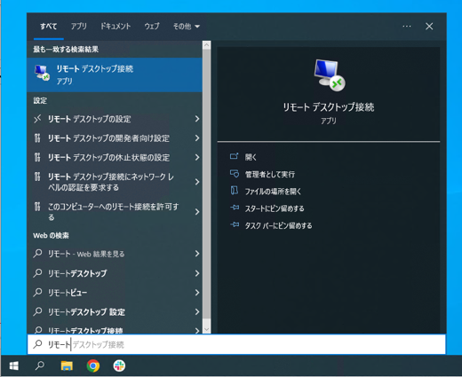

1. チームごとに、決められたコンピュータに対して接続します。  
  「コンピューター」に以下アドレスを記入して「接続」を押します。  
  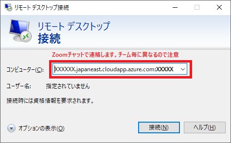  
  
    |チーム|コンピューター|
    |-|-|
    |A~E|__※接続先アドレスはZoomのチャットで連絡します。__|

1. 以下ユーザー名とパスワードを入力してOKします。  
   自分のアカウント名がすでに入っている場合は、下のほうにある「その他」→「別のアカウントを使用する」を押してください。
  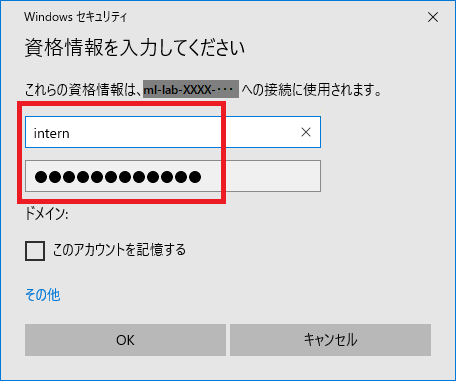
    |チーム|ユーザー名|パスワード|
    |-|-|-|
    |共通|intern|intern#1|

1. これで開発用PCにログインできました。  
   ログイン出来たら、チームメンバに開発用PCの画面を共有して進めて行きましょう。
2. 接続の練習はここまでです。  
   リモートデスクトップを切断し、次の人に開発用PCに接続してもらいましょう。 
   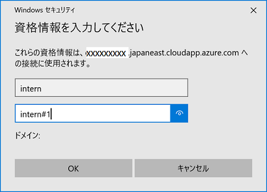 

Macの人

1. App Storeを開いて、「Microsoft Remote Desktop」で検索します。  
    出てきたアプリを「インストール」して、インストールが終わったら「開く」を押してください。  
  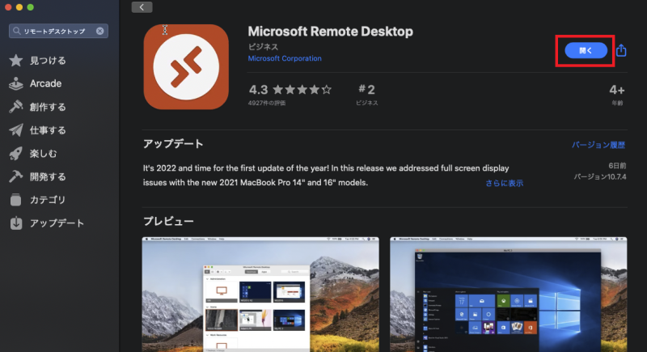

1. 最初に聞かれる内容は「Not now」を選択します。  
  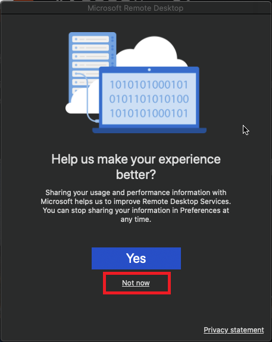

1. 「Add PC」を押します。  
  

1. チームごとに、決められたコンピュータに対して接続します。  
  出てきた画面の「PC name」に以下を入れて、「Add」を押します。  
  
    |チーム|PC name|
    |-|-|
    |A~E|__※接続先アドレスはZoomのチャットで連絡します。__|

    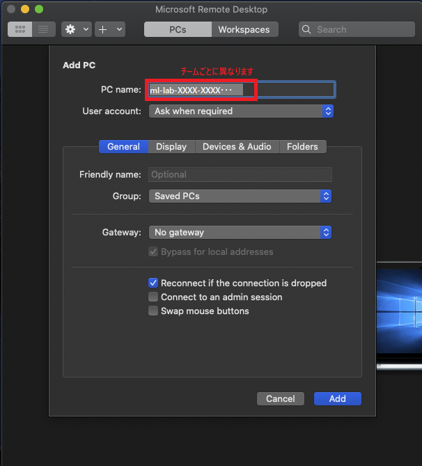

1. 作成されたボタンをダブルクリックします。  
  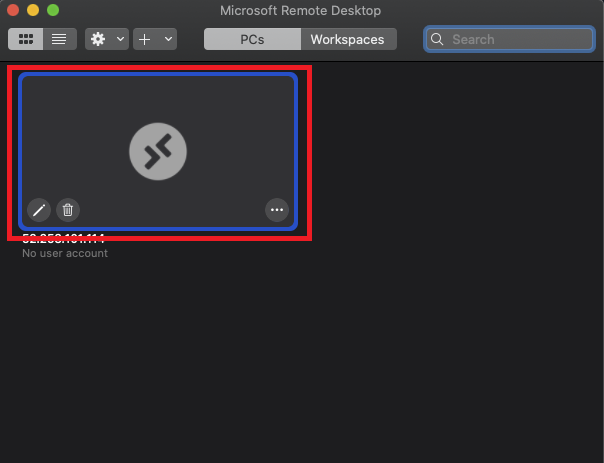

1. ユーザー名とパスワードに以下を入れて「Continue」を押します。
    |チーム|Username|Password|
    |-|-|-|
    |共通|intern|intern#1|

    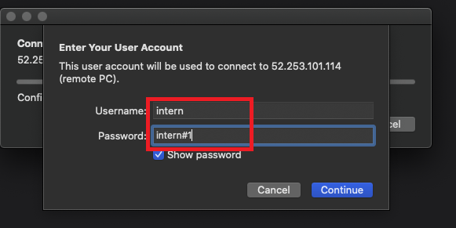

1. 以下のようなメッセージが出た場合、「Continue」を押します。  
  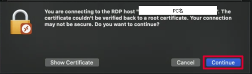

1. これで開発用PCにログインできました。  
   ログイン出来たら、チームメンバに開発用PCの画面を共有して進めて行きましょう。
2. 接続の練習はここまでです。  
   リモートデスクトップを切断(スタートメニュー→電源→切断)し、次の人に開発用PCに接続してもらいましょう。 
   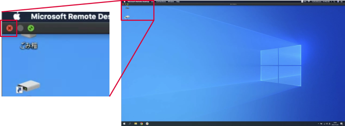 

## 開発を始める

1. チームメンバに開発用PCの画面を共有して進めましょう。

1. 開発用PCでSlackを起動する。  
  Zoomのブレークアウトルームに移動後の、社員との連絡手段として使用します。  
  アカウント・ワークスペース設定済みとなっています。

1. 開発用PCのデスクトップにある「Z」のリンクを開き、  
   「マイクロマウス開発手順書.pdf」を開きます。  

1. 手順書を参考に、プログラムがビルドできる(p7まで実施できる)ことを確認し、プログラム開発に入りましょう。

* その他の格納されているファイルは以下です。
    |格納ファイルフォルダ名|用途|内容|
    |-|-|-|
    |Z:\1_マイクロマウス開発手順書.pdf|1 開発|プログラムの開発の流れ|
    |Z:\1_設計書\MicroMouse.iproj|1 開発|マイクロマウス用プログラムの設計書|
    |Z:\1_Internship_program|1 開発|マイクロマウス用プログラム|
    |Z:\2_マイクロマウス単体テスト手順書.pdf|2 単体テスト|単体テストの手順書|
    |Z:\2_unit_test|2 単体テスト|単体テスト用プログラム|

* (参考)PCには以下ツールが入っています。
  * マイクロマウス用コンパイラ(CS+)・・・マイクロマウス用プログラムのコンパイラ
  * 次世代設計ツール NextDesign (デンソークリエイト製ツール)・・・設計書のエディタ

## 開発用PC以外からプログラムや設計書を参照する(読み取り専用)
以下のリンクは、開発用PC以外(各自のPC)からでも開くことができます。

  |格納ファイルフォルダ名|用途|内容|
  |-|-|-|
  |[Z:\1_マイクロマウス開発手順書.pdf](https://github.com/dcincedu/intern/blob/master/doc/build/マイクロマウス開発手順書.pdf)|1 開発|プログラムの開発の流れ|
  |[Z:\1_設計書\MicroMouse.iproj](https://dcincedu.github.io/intern/doc/design/index.html)|1 開発|マイクロマウス用プログラムの設計書|
  |[Z:\1_Internship_program](https://github.com/dcincedu/intern/tree/master/program/Internship_program)|1 開発|マイクロマウス用プログラム|
  |[Z:\2_マイクロマウス単体テスト手順書.pdf](https://github.com/dcincedu/intern/blob/master/doc/build/マイクロマウス単体テスト手順書.pdf)|2 単体テスト|単体テストの手順書|
  |[Z:\2_unit_test](https://github.com/dcincedu/intern/tree/master/program/unit_test)|2 単体テスト|単体テスト用プログラム|

* 走行デモ動画
  * https://github.com/dcincedu/intern/tree/master/doc/movie
